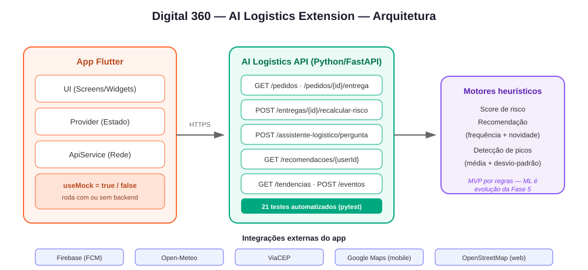

# Digital 360 - Smart HAS | AI Logistics Extension (Enterprise Challenge Leroy Merlin)

App mobile em **Flutter/Dart** do projeto **Smart HAS / Digital 360** (Sociedade 5.0),
com a camada **AI Logistics Extension** desenvolvida em parceria com a Leroy Merlin
para o Enterprise Challenge FIAP. Reimplementação da versão anterior feita em Kotlin.

## Grupo
- Eduardo Andrade Martins Vasques - RM 556970
- Otavio Ramos dos Santos Souza - RM 550361
- Enzo Miranda Ward de Paiva - RM 557632
- Rafael Pinto de Albuquerque - RM 559136
- Guilherme Leoni Vidigal Tiburcio - RM 557500

## Arquitetura



O backend real da AI Logistics Extension está na pasta [`backend/`](backend/)
deste repositório (Python/FastAPI) - implementa de fato os endpoints que antes só
existiam mockados no app (recomendação, risco, assistente, detecção de sazonalidade,
reagendamento, feedback, renovação de sessão). Ver [`backend/README.md`](backend/README.md)
para detalhes e testes.

## Funcionalidades

| Área | O que tem |
|---|---|
| Aprendizagem | Trilhas com progresso real (botão "Continuar curso" avança de verdade) e celebração ao concluir |
| Cursos comunitários | Qualquer usuário pode virar tutor e criar/publicar cursos direto (sem fila de aprovação), com rascunho inicial gerado por heurística de template (não IA generativa) |
| Comunidade | Fórum de perguntas e respostas, gamificação (cursos concluídos, sequência de dias, pontos, ranking) e painel de impacto com números da base atual |
| Cuidador e engajamento | Modo cuidador (acompanhamento somente-leitura), certificado de conclusão em PDF, indicação de amigos (share sheet do SO), cupom de recompensa simbólico e avaliação de cursos com perfil público do tutor |
| LGPD / privacidade | Tela de Política de Privacidade, aceite obrigatório no cadastro, CPF mascarado por padrão no Perfil (com opção de revelar) e exclusão da própria conta |
| Acessibilidade adicional | Tema em 3 vias (sistema/claro/escuro), onboarding com passo de perfil (idoso/cuidador/pessoa com deficiência) que personaliza a dica final, e gancho preparado para vídeo em Libras nos cursos |
| Guia de serviços | Busca por texto **e por voz**, favoritos, filtro "somente favoritos", histórico de buscas recentes, leitura em voz alta (TTS) |
| AI Logistics | Risco de entrega (agora considerando o clima real da região), reagendamento com 1 toque, avaliação pós-entrega, telas de **Recomendações** e **Tendências/Sazonalidade** |
| Assistente de IA | Chat com rolagem automática, seletor de pedido, histórico salvo entre sessões |
| Conta | Cadastro com CPF validado (dígitos verificadores) e máscara, login, login biométrico (reautentica sessão salva), "esqueci minha senha", renovação automática de sessão (refresh token), editar nome, CPF/nome completo visíveis no perfil |
| Acessibilidade | Tema claro/escuro, ajuste de tamanho de fonte, onboarding na primeira abertura, notificações configuráveis |
| Robustez | Timeout em todas as chamadas de rede, mensagens de erro amigáveis (diferenciando sem-conexão de erro de servidor), tokens de sessão em armazenamento seguro (Keystore/Keychain), Analytics + Crashlytics (mesmo padrão defensivo do FCM) |
| Notificações | Alertas locais de risco ALTO/CRÍTICO com deep link — tocar na notificação abre direto a tela do pedido |

## Como o projeto atende à Fase 4 / AI Logistics Extension
| Parte | Onde está no código |
|------|----------------------|
| Flutter (widgets, estado, componentização) | `lib/ui/`, `lib/providers/` (Provider/ChangeNotifier) |
| Padrão de estado | **Provider** - 1 ChangeNotifier por domínio (auth, cursos, serviços, logística, configurações) |
| Mapas e geolocalização | `lib/ui/screens/mapa_screen.dart` - Google Maps no mobile, **OpenStreetMap na web** (sem chave) |
| 2+ web services | `weather_service.dart` (Open-Meteo) e `viacep_service.dart` (ViaCEP) - ambos reais, sem chave, e o clima **alimenta de verdade** o cálculo de risco |
| Firebase + FCM push | `lib/data/services/notification_service.dart` (Firebase Core + FCM + notificação local, configurável em Perfil > Configurações) |
| AI Logistics Extension (backend real) | [`backend/`](backend/) - recomendação, risco, assistente, sazonalidade, reagendamento, feedback |

## Estrutura (camadas)
```
lib/
  core/        -> tema claro/escuro, cores Smart HAS, constantes, utilitarios (CPF)
  data/
    models/    -> Usuario, Curso, Servico, PedidoLogistico, RiscoLogistico
    services/  -> ApiService (singleton, mock+real, com retry de sessao),
                  WeatherService, ViaCepService, NotificationService (FCM),
                  LocationService, SessionService (secure storage), TtsService,
                  PerfilLocalService
  providers/   -> AuthProvider, CursosProvider, ServicosProvider,
                  LogisticaProvider, SettingsProvider, RecomendacoesProvider,
                  CursoAutoriaProvider, ForumProvider, GamificacaoProvider,
                  CuidadorProvider
  ui/
    screens/   -> Splash, Onboarding, Login, Register, Home (bottom nav),
                  Cursos+detalhe, CriarCurso, MeusCursos, Guia+detalhe,
                  Logistica+detalhe entrega, Assistente, Mapa, Recomendacoes,
                  Tendencias, Configuracoes, Perfil, Creditos, Forum+detalhe
                  pergunta, Conquistas, Impacto, Acompanhamento, Indicacao,
                  TutorPerfil
    widgets/   -> RiskBadge, StatusChip, NivelBadge, ComunidadeBadge,
                  OfflineBanner, EmptyState, StatCard, LibrasVideoPlaceholder
```
Fluxo: **UI -> Provider (estado) -> Service (rede) -> Model**. Equivale ao MVVM
(ViewModel/Repository) do projeto Kotlin original.

## Rodar o projeto
> Requer Flutter SDK 3.4+ instalado (`flutter --version`).

1. Gere o scaffolding nativo (cria as pastas `android/`, `web/` etc. que faltam,
   **sem apagar `lib/`**):
   ```bash
   flutter create . --org br.com.fiap --project-name digital360_flutter
   ```
2. Baixe as dependências:
   ```bash
   flutter pub get
   ```
3. Rode (mobile/emulador):
   ```bash
   flutter run
   ```
   Ou no navegador (usa OpenStreetMap no mapa, sem precisar de chave):
   ```bash
   flutter run -d chrome
   ```

O app já roda **sem backend** (`ApiConstants.useMock = true`, em
`lib/core/constants/api_constants.dart`), com dados mock idênticos aos usados nos
testes automatizados de heurística do backend real. Para apontar ao backend
real da AI Logistics Extension:
```dart
static const bool useMock = false;
static const String baseUrl = 'http://10.0.2.2:8080'; // emulador Android
```
(veja como subir o backend em [`backend/README.md`](backend/README.md))

## Configurar chaves (opcional, apenas para o mapa mobile)
- **Google Maps** (só necessário no Android/iOS - a versão web usa OpenStreetMap
  sem chave): em `android/app/src/main/AndroidManifest.xml`, troque
  `YOUR_GOOGLE_MAPS_API_KEY` pela sua chave (Google Cloud > Maps SDK for Android).
- **Firebase/FCM**: troque `android/app/google-services.json` pelo arquivo real do
  console Firebase (mesmo package `br.com.fiap.digital360`).
  Sem isso, o push fica em modo local (a notificação simulada ainda funciona).

## Web services usados
1. **Open-Meteo** (`https://api.open-meteo.com`) - clima na região de entrega; o
   resultado **alimenta de verdade** o cálculo de risco logístico (não é só texto
   informativo). Sem API key.
2. **ViaCEP** (`https://viacep.com.br`) - resolve endereço completo a partir do CEP
   para validar o destino da entrega. Sem API key.

## Notificação push
- Perfil > Configurações permite ligar/desligar os alertas de entrega.
- Em "Detalhe da entrega", ao recalcular risco ALTO/CRÍTICO (com o alerta ativo),
  o app dispara automaticamente uma notificação local.
- Com Firebase configurado, mensagens FCM recebidas com o app aberto viram notificação.
- Tocar na notificação de risco abre direto a tela do pedido (deep link) - a navegação
  usa um `navigatorKey` global registrado em `main.dart`, mantendo `NotificationService`
  independente de telas/providers específicos (ele só repassa o payload).

## Acessibilidade
Pensado para o público-alvo (idosos, baixo letramento digital):
- Tema claro **ou** escuro, ambos de alto contraste.
- Ajuste de tamanho de fonte (Perfil > Configurações).
- Leitura em voz alta (TTS) do conteúdo de cursos e serviços.
- Busca por voz no Guia de Serviços.
- Onboarding de 3 telas na primeira abertura.
- Confirmação antes de ações sensíveis (reagendar entrega, sair da conta).

## Testes
```bash
flutter test
```
80 testes automatizados: widgets (RiskBadge, StatusChip, NivelBadge), um golden test do
RiskBadge (execução local), telas com estado assíncrono (`AssistenteScreen`,
`TendenciasScreen`, `RecomendacoesScreen`, `ConfiguracoesScreen`, incluindo o toggle de
biometria), validação de login,
validação de CPF (incluindo o formatador de máscara de digitação e a máscara de
exibição), heurística de risco/assistente (`MockData`), o onboarding ramificado por
perfil, e os providers `AuthProvider`, `CursosProvider`, `ServicosProvider`,
`LogisticaProvider`, `RecomendacoesProvider`, `CursoAutoriaProvider`, `ForumProvider`,
`GamificacaoProvider`, `CuidadorProvider` e `SettingsProvider` (incluindo reagendamento,
impacto do clima no risco, o fluxo de virar tutor/gerar rascunho/publicar curso,
perguntar/responder no fórum, registrar conclusão de curso e refletir no resumo de
gamificação, vincular-se como cuidador, excluir a própria conta, o tema em 3 vias,
histórico de buscas recentes, e um teste de regressão para o carregamento assíncrono
de favoritos).

**Achado real durante a escrita destes testes**: `AuthProvider.login()` grava a sessão
via `flutter_secure_storage` (um plugin com implementação nativa por `MethodChannel`).
Dentro de `testWidgets()` (modo de teste de widget, sem binding de plataforma real por
trás), chamar `login()` de verdade trava o teste indefinidamente esperando uma resposta
de plataforma que nunca chega. A correção nos testes de tela foi popular o `Usuario`
diretamente no provider (sem passar pelo `SessionService`) - os testes que chamam
`login()` de verdade (ex.: `auth_provider_test.dart`) usam `test()` puro, sem
`testWidgets()`, e por isso não são afetados.

### Teste de integração ponta-a-ponta (`integration_test/app_test.dart`)
Cobre o fluxo completo: login em modo demonstração → navega para Cursos → avança o
progresso de um curso → volta ao Perfil → sai da conta. Está escrito e correto, mas
**não foi possível executá-lo de fato neste ambiente de desenvolvimento** - tentativa
honesta com as 3 rotas disponíveis:
- **Windows desktop**: projeto sem o scaffolding `windows/` (não configurado).
- **Chrome/Edge via `flutter test`**: `flutter test` não suporta devices web para
  integration tests (é preciso `flutter drive` + um servidor `chromedriver` rodando na
  porta 4444, que não está instalado neste ambiente).
- **Emulador Android**: o emulador inicia normalmente, mas o build Gradle falha com
  `Unable to establish loopback connection` - uma restrição de rede/firewall deste
  ambiente Windows específico, não um bug no código do app. Tentativa de contorno:
  desligar o Gradle Daemon (`org.gradle.daemon=false` em `android/gradle.properties`,
  já commitado) não resolveu - o mesmo erro persiste mesmo sem o daemon, indicando que
  o bloqueio está em outro processo Gradle/JVM que também usa loopback (não algo
  ajustável só por configuração de projeto).

Para rodar de verdade num ambiente sem esse bloqueio de rede (outra máquina, ou este
mesmo ambiente com uma exceção de firewall para `java.exe`/Gradle), ou um `chromedriver`
instalado:
```bash
flutter test integration_test/app_test.dart -d <emulator-id>
# ou, para a web:
flutter drive --driver=test_driver/integration_test.dart --target=integration_test/app_test.dart -d chrome
```

## Limitações conhecidas
- O mapa mobile (Android/iOS) depende de uma chave real do Google Maps que o grupo
  optou por não commitar publicamente, por segurança. A versão web usa OpenStreetMap
  e funciona sem nenhuma chave.
- Busca por voz e leitura em voz alta dependem do suporte do navegador/dispositivo
  (e de permissão de microfone no caso da busca por voz) - ambas falham de forma
  silenciosa e sem quebrar a tela quando indisponíveis.
- O backend real (`backend/`) é um MVP heurístico (regras), não Machine Learning
  treinado - decisão consciente alinhada à orientação da mentoria Leroy Merlin
  ("comece simples, escale com consistência"). A evolução para ML com dados reais
  é o próximo passo planejado (ver README do backend).
- O backend real agora tem persistência de verdade (SQLite) e autenticação JWT real
  (cadastro/login próprios, token validado por assinatura, CORS restrito por lista
  de origens) - ver [`backend/README.md`](backend/README.md) para detalhes.
- O teste de integração ponta-a-ponta (`integration_test/app_test.dart`, seção
  acima) está escrito, mas nunca foi executado com sucesso neste ambiente de
  desenvolvimento - rodar numa máquina sem o bloqueio de rede do Gradle (ou com
  `chromedriver` instalado) é o próximo passo natural para validá-lo de fato.
